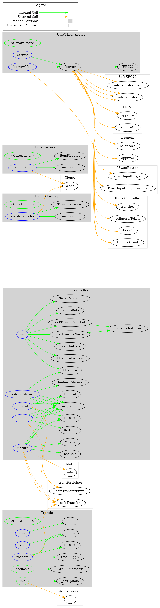

# Button Tranche

A protocol of smart contracts to tranche price risk for rebasing assets.

Any rebasing asset can be deposited as collateral, in return for a series of "tranche" tokens. These tranches represent different slices of the value of the underlying asset. They are typically denoted alphabetically where the A-Tranche is the safest, and the Z-Tranche is the riskiest, but also benefits from leveraged upside. As the price of the underlying collateral changes, so do the respective values of the tranche tokens.

Users can redeem their tranche tokens for the underlying collateral. Tranche tokens get their differing risk profiles because this redemption occurs in a waterfall sequence - tranches are paid back in full in order of seniority. The Z-Tranche is paid out last, but benefits from _all_ gains of the underlying asset.

This redemption can occur in two manners:

- _Mature_: After a bond is "mature", the current value of the underlying collateral is distributed to holding pools for the tranche holders. This locks in the distribution rates - any further changes to the value of the underlying collateral will not affect the value that holders receive. In this state, users can redeem any of their tranche tokens for the respective slice of the holding pool, using the `redeemMature(address token, uint256 amount)` function on the `BondController` instance.
- _Immature_: When a bond is not yet mature, users can still redeem their tranche tokens - with some restrictions. In order to maintain the value distribution for all other holders, any user who wishes to redeem from an immature bond must do so with _all_ of the tranche tokens at once, in the _original tranche ratio_.

The diagram below depicts the process of depositing a rebasing asset (AMPL in this case), in return for a set of tranche tokens.


The diagram below depicts the process of redeeming tranche tokens in a mature bond


The diagram below depicts the process of redeeming tranche tokens in an immature bond


## Usage

### Pre Requisites

Before running any command, make sure to install dependencies:

```sh
$ yarn install
```

### Compile

Compile the smart contracts with Hardhat:

```sh
$ yarn compile
```

### TypeChain

Compile the smart contracts and generate TypeChain artifacts:

```sh
$ yarn typechain
```

### Lint Solidity

Lint the Solidity code:

```sh
$ yarn lint:sol
```

### Lint TypeScript

Lint the TypeScript code:

```sh
$ yarn lint:ts
```

### Test

Run the Mocha tests:

```sh
$ yarn test
```

### Coverage

Generate the code coverage report:

```sh
$ yarn coverage
```

### Report Gas

See the gas usage per unit test and average gas per method call:

```sh
$ REPORT_GAS=true yarn test
```

### Clean

Delete the smart contract artifacts, the coverage reports and the Hardhat cache:

```sh
$ yarn clean
```

## Syntax Highlighting

If you use VSCode, you can enjoy syntax highlighting for your Solidity code via the
[vscode-solidity](https://github.com/juanfranblanco/vscode-solidity) extension. The recommended approach to set the
compiler version is to add the following fields to your VSCode user settings:

```json
{
  "solidity.compileUsingRemoteVersion": "v0.8.3+commit.8d00100c",
  "solidity.defaultCompiler": "remote"
}
```

Where of course `v0.8.3+commit.8d00100c` can be replaced with any other version.

## Flow diagram


